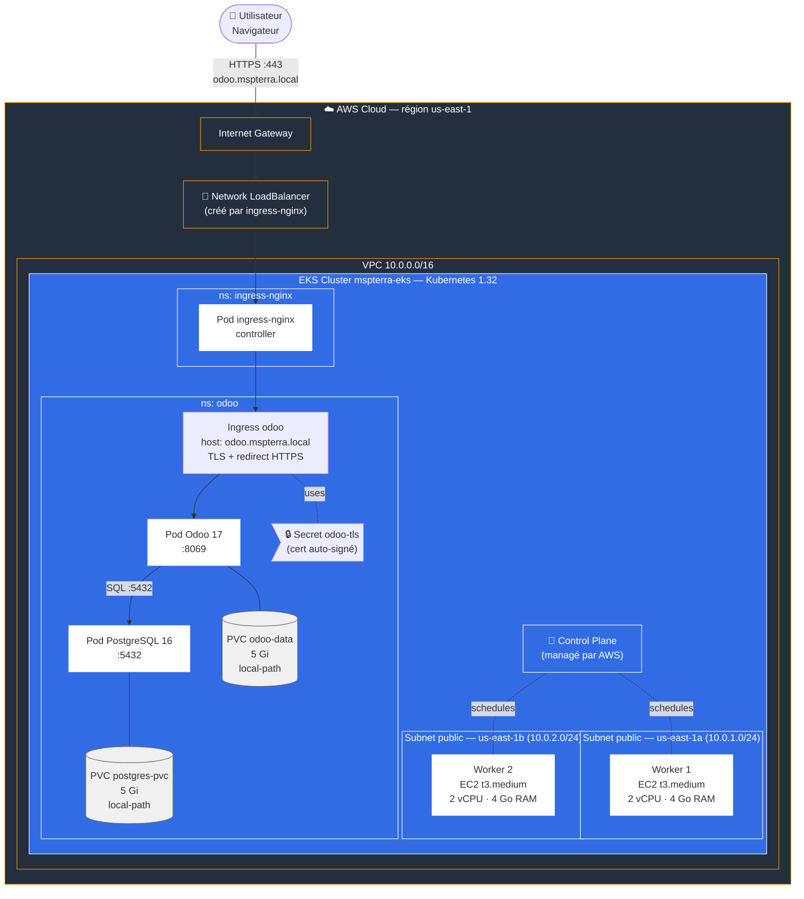
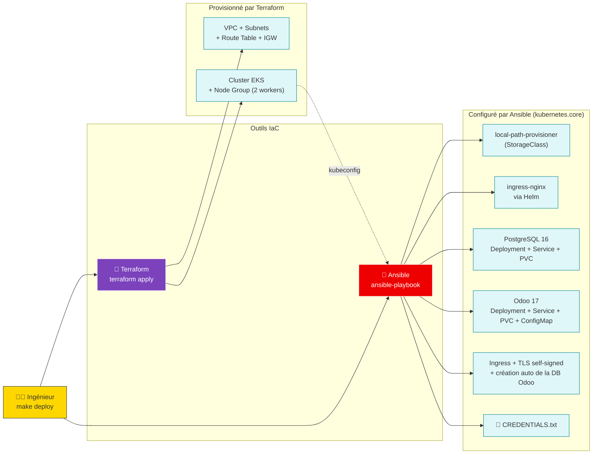
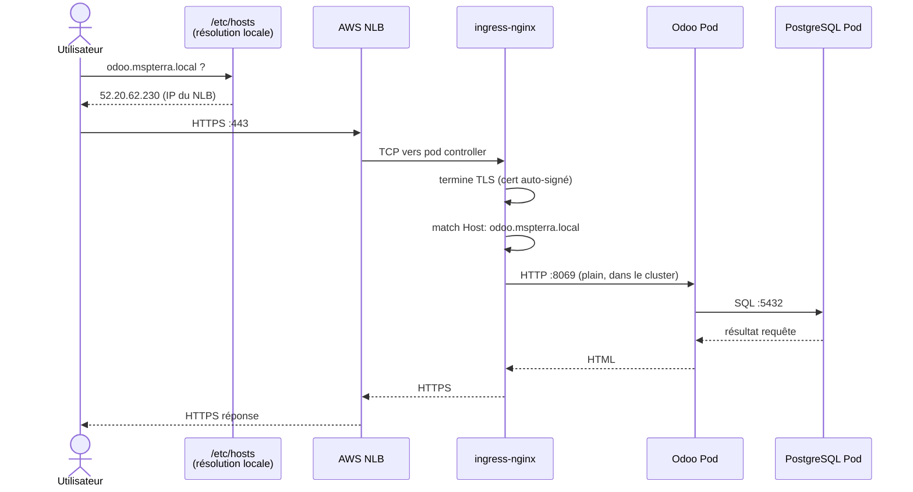

# Architecture MSPR TPRE961

## 1. Architecture runtime (infrastructure déployée)

---

## 2. Flux de déploiement (Infrastructure as Code)

---

## 3. Flux réseau d'une requête utilisateur

---

## 4. Stack technologique

| Couche | Technologie | Rôle |
|--------|-------------|------|
| Cloud | **AWS EKS** (us-east-1) | Cluster Kubernetes managé |
| Compute | **EC2 t3.medium × 2** | Workers Kubernetes |
| Réseau | **VPC + 2 subnets publics** | Isolation + HA multi-AZ |
| Orchestration | **Kubernetes 1.32** | Orchestration conteneurs |
| Ingress | **ingress-nginx** + AWS NLB | Exposition HTTPS |
| Storage | **local-path-provisioner** | Volumes persistants |
| App | **Odoo 17** (image officielle) | ERP |
| DB | **PostgreSQL 16** (image officielle) | Base de données |
| TLS | **Certificat auto-signé** | Chiffrement HTTPS |
| IaC compute | **Terraform 1.14** | Provisionnement AWS |
| IaC config | **Ansible + kubernetes.core** | Déploiement applicatif |
| Packaging | **Helm 3** | Déploiement ingress-nginx |
| Orchestration | **GNU Make** | Commande unique `make deploy` |
