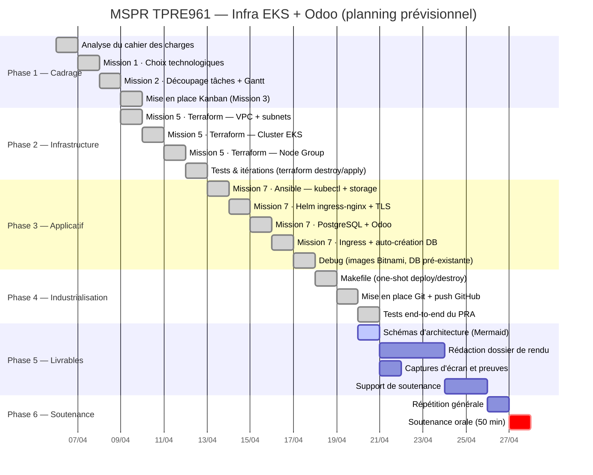
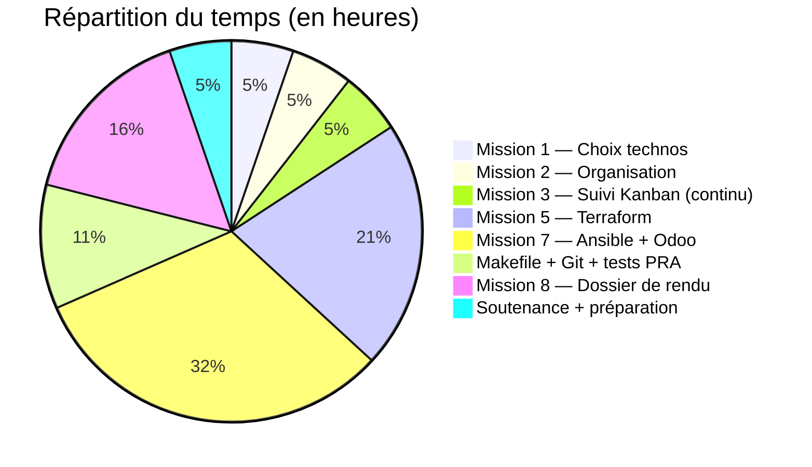

# Diagramme de Gantt — MSPR TPRE961

## Planning prévisionnel (durée totale : 19 h de préparation sur ~3 semaines)

---

## Répartition du temps par mission

---

## Notes sur le planning

- **Mission 4 (Packer)** non réalisée : le choix d'AWS EKS (managé) rend Packer inutile car les AMIs des workers sont gérées par AWS.
- **Mission 6 (Ansible K8s baremetal)** non réalisée : le control-plane est managé par AWS EKS, aucun cluster à bootstrapper manuellement.
- **Jalon critique** : la disponibilité des tokens AWS Academy (4 h) a imposé des cycles `make destroy` / `make deploy` réguliers pour valider l'idempotence de l'IaC.
- **Imprévus gérés** :
  - Tags Bitnami supprimés de Docker Hub → pivot vers images officielles `odoo:17` et `postgres:16`
  - Initialisation automatique de la base via POST `/web/database/create` depuis Ansible
